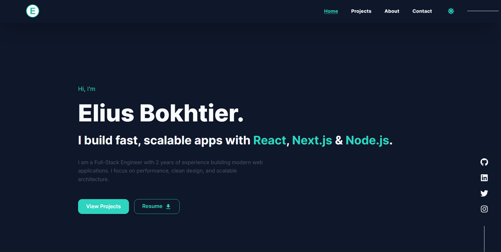
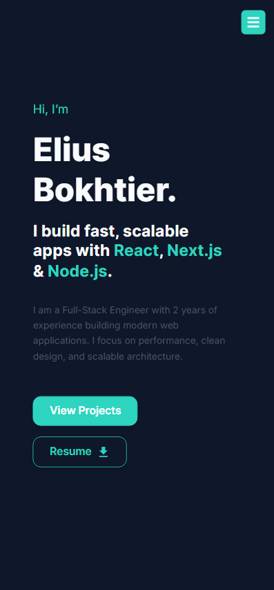

**# Bokhtier — Personal Portfolio**

<<<<<<< HEAD
A simple, clean, and responsive personal portfolio built with Next.js and TypeScript to showcase projects, skills, and contact info.

## Demo

Live site: https://bokhtier.online (replace with actual deployment URL)

## Table of contents
=======
Welcome! This is my personal portfolio built with Next.js. It’s a simple, clean, and responsive site that showcases my work, skills, and projects.

#Tech Stack

Framework: Next.js (React) with TypeScript  
Styling: CSS and optionally Tailwind CSS  
Deployment: Vercel  

**#About Me**  

Hello! I'm Elius Bokhtier, a web developer passionate about crafting clean, modern, and interactive web experiences. I love solving problems, turning ideas into reality, and learning new technologies along the way.
When I’m not coding, you’ll find me experimenting with design, traveling, playing video games, riding, or tinkering with electronics. My goal is to keep building products people love to use.


-----------------------------  For Local Machine  ------------------------------

#Running the Portfolio Locally
If you'd like to run this portfolio on your own machine, follow these steps:

Clone the repository:
```
git clone https://github.com/your-username/your-portfolio.git
```
#Navigate into the directory:
```
cd your-portfolio
```
#Install the dependencies:
```
npm install
```
#Run the development server:
```
npm run dev
```


Now, you can open your browser and navigate to ```http://localhost:3000``` to view the portfolio locally.
>>>>>>> fae84af7658dc97d3416e1d03127b906965bb47e

-   [Tech Stack](#tech-stack)
-   [Preview](#preview)
-   [Features](#features)
-   [Getting Started](#getting-started)
    -   [Prerequisites](#prerequisites)
    -   [Install and Run](#install-and-run)
    -   [Build for Production](#build-for-production)
-   [Environment Variables](#environment-variables)
-   [Deployment](#deployment)
-   [Contributing](#contributing)
-   [License](#license)
-   [Contact](#contact)
-   [Acknowledgements](#acknowledgements)

## Tech Stack

-   Framework: Next.js (React) + TypeScript
-   Styling: CSS / Tailwind CSS (optional)
-   Deployment: Vercel

## Preview

Add screenshots or an animated GIF to show the site. Example:



## Features

-   Responsive, mobile-first design
-   Project showcase with links and descriptions
-   Contact section / social links
-   (Optional) Blog, forms, or integrations — describe what your site includes

## Getting Started

### Prerequisites

-   Node.js >= 16 (recommended)
-   npm or yarn

### Install and Run

```bash
# clone the repo
git clone https://github.com/bokhtier19/bokhtier.git

cd bokhtier

# install dependencies
npm install
# or
# yarn

# run the development server
npm run dev
# or
# yarn dev
```

Open http://localhost:3000 in your browser.

### Build for production

```bash
# build
npm run build

# start production server
npm start
```

## Deployment

This project is ready for deployment on Vercel. For a simple Vercel deployment:

1. Import the GitHub repository into Vercel.
2. Set any environment variables in the Vercel dashboard.
3. Deploy — Vercel will handle builds automatically.

## Contributing

Contributions are welcome. Suggested workflow:

1. Fork the repository
2. Create a branch: `git checkout -b feat/some-feature`
3. Commit your changes: `git commit -m "Add feature"`
4. Push and open a Pull Request

## License

This project is licensed under the MIT License — see the [LICENSE](./LICENSE) file for details.

## Contact

Elius Bokhtier — bokhtierelius19@gmail.com
GitHub: [@bokhtier19](https://github.com/bokhtier19)

## Acknowledgements

-   Built with Next.js
-   Inspired by many open-source portfolio templates
